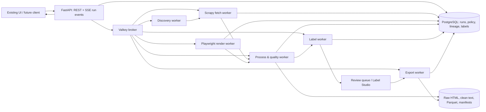

# LoomSet Backend Architecture Proposal

## 1. Repository Findings

LoomSet is currently a research-and-prototype repository. The only executable product surface is a standalone `index.html` user interface. Its six stages are: define a niche, select sources, extract, clean, label, and export. The interface deliberately simulates crawling, cleaning, labels, confidence scores, and JSONL download locally; it has no HTTP calls, persistence, authentication, server-side job state, or actual extraction.

The existing research already establishes the important constraints:

- every core component must be free to run and open source;
- scraping must remain responsible (`robots.txt`, rate limiting, no CAPTCHA/login-wall bypassing);
- the pipeline must collect provenance, clean text, optionally redact PII, label records, support review, and produce standard ML-ready datasets;
- it should work first on a laptop and grow to moderate workloads without introducing paid services.

The appropriate next architecture is therefore a **modular monolith with isolated workers**, not a microservice platform. A single API process and a small set of specialized queue workers give the prototype durable jobs, retries, resource limits, and clean component boundaries. The same boundaries permit later horizontal scaling without prematurely requiring Kubernetes, a service mesh, or cloud dependencies.

## 2. Architecture Goals and Non-Goals

### Goals

1. Preserve the UI’s staged workflow while making each run reproducible, resumable, observable, and exportable.
2. Use a default stack with OSI-approved, permissive licenses where possible: MIT, BSD-3-Clause, PostgreSQL License, and Apache-2.0.
3. Minimize RAM, browser usage, and disk duplication: static HTTP extraction is the default; browser rendering and LLM inference are opt-in escalation paths.
4. Retain raw evidence, transformations, model/prompt versions, labels, and human decisions so that exports have a defensible lineage.
5. Support Windows, Linux, macOS, and containerized deployments through Python, HTTP/OpenAPI, PostgreSQL, and S3-compatible storage interfaces.
6. Treat source access policy, PII handling, and licensing/copyright review as gates in the pipeline, not as documentation-only guidance.

### Non-Goals

- Circumventing CAPTCHAs, authentication, paywalls, robots policies, rate limits, or source terms.
- Promising legal compliance, complete PII detection, or copyright permission through automation.
- Building a distributed multi-tenant SaaS before there is a measured workload requiring it.
- Replacing the existing front-end in this proposal.

## 3. Recommended Component Set

| Concern | Recommended default | Why it fits LoomSet | Scale-up / fallback | License posture |
|---|---|---|---|---|
| API and contract | FastAPI + Pydantic | Typed validation, OpenAPI contract, generated interactive docs, Python alignment | Remains the API at every phase | MIT |
| Background work | Celery workers + Valkey | Durable, retryable, independently scalable jobs; separates long crawls and inference from HTTP requests | Start with one worker; add queues/workers by workload | BSD-3-Clause + BSD-3-Clause |
| Run metadata | PostgreSQL | Transactions for state transitions; indexed `jsonb`; built-in full-text search; portable mature ecosystem | SQLite only for an explicitly single-user local proof of concept | PostgreSQL License |
| Raw/artifact storage | Local filesystem adapter first; SeaweedFS OSS when shared S3-compatible storage is needed | Raw bodies and exported artifacts stay out of the relational database; object API removes storage lock-in | Any S3-compatible object store behind the adapter | Local FS; SeaweedFS Apache-2.0 |
| Crawler | Scrapy | Efficient asynchronous HTTP crawling, retries, per-domain constraints, AutoThrottle | Per-domain workers / queue partitions | BSD-3-Clause |
| Dynamic rendering | Playwright worker pool | Use only after static retrieval/extraction fails or a source profile requires JavaScript | Separate, hard-limited browser queue | Apache-2.0 |
| Main-text extraction | Trafilatura, with lxml/BeautifulSoup fallback | Extracts main text and metadata while minimizing boilerplate; modular fallback supports unusual sources | Site-specific extractor profiles, not global browser use | Apache-2.0 for current Trafilatura |
| Cleaning / quality | Unicode normalization, language-ID, exact hashes, MinHash/SimHash near-duplicate clustering, rule-based quality score | Cheap filters eliminate most low-value text before expensive labeling | Batch processing over Parquet | Library licenses must be pinned and checked |
| PII screening | Microsoft Presidio plus project-specific rules | Provides local detection and redaction/mask/hash options; records a reviewable finding | Human review for high-risk or uncertain findings | MIT |
| Auto-labeling | Rules/weak supervision first; Ollama-hosted, license-approved local model second | Rules are cheap and explainable; local inference avoids per-token cost and can emit constrained JSON | Dedicated CPU/GPU inference worker | Ollama MIT; **model license evaluated separately** |
| Human review | Label Studio Community | Self-hosted text annotation and standard exports; use only for uncertain/disputed records | Separate instance with PostgreSQL | Apache-2.0 |
| Dataset artifacts | Parquet as canonical; JSONL/CSV as export formats | Columnar storage reduces size and scans; JSONL stays universally consumable | DuckDB / Arrow-based analytics on artifacts | Apache-2.0 ecosystem |
| Observability | OpenTelemetry + Prometheus + Grafana (optional) | Open standards, minimal instrumentation path, metrics before heavy log infrastructure | Add Loki only when logs warrant it | Apache-2.0 |

**Important licensing rule:** free access is not equivalent to open source. This design excludes paid APIs and credit-based services from the critical path. Every dependency must be pinned with its license in a software bill of materials (SBOM). Model weights, training data, and source-page reuse rights require their own approval record; the runtime license does not grant those rights.

## 4. Logical Design

### Why this is efficient

- The API never holds a crawl, browser session, export, or LLM inference open. It validates a run request, persists it, enqueues an idempotent task, and streams status to the UI.
- Jobs exchange small record identifiers, URIs, checksums, and immutable artifact versions—not raw HTML in broker messages or large text blobs in PostgreSQL.
- Static fetch and extraction are the normal path. A render task is created only when a source profile requires it or static extraction fails a configured quality threshold.
- The processing worker runs cheap rejection tests first: content type/size, hash, language confidence, minimum text, boilerplate/quality score, and PII policy. It invokes semantic labeling only for records that survive.
- Per-domain crawl queues and concurrency budgets prevent a slow or problematic host from consuming all worker capacity.

## 5. Run Lifecycle and State Model

Treat a dataset build as an immutable **run** with a versioned configuration snapshot. A user may cancel a run, but never silently mutate a completed run. Re-running creates a new run that references the previous configuration and artifacts.

| Stage | Input | Output / persisted evidence | Failure behavior |
|---|---|---|---|
| `draft` | niche, language, seed URLs, source types, policy | validated configuration revision | return validation errors synchronously |
| `policy_checked` | candidate URL/domain | robots result, terms/policy decision, domain budget | reject and record reason; do not fetch |
| `discovered` | allowed seed/query results | canonical URL, discovery parent, priority, URL hash | de-duplicate URL; retry only transient discovery faults |
| `fetched` | canonical URL | raw-body object URI, headers, status, timing, content hash | bounded retry with exponential backoff; terminal reason retained |
| `rendered` (optional) | static failure / profile | rendered HTML object URI, browser version | isolated queue, strict timeout; no automatic anti-bot escalation |
| `extracted` | raw or rendered HTML | text, metadata, extraction method/version, extraction score | retain raw evidence and mark extraction failure |
| `quality_checked` | extracted text | language, hash/near-duplicate cluster, PII findings, acceptance reason | quarantine/review or reject with reason |
| `labeled` | accepted text + taxonomy revision | label candidates, confidences, rules/model/prompt versions | low-confidence or disagreement enters review queue |
| `reviewed` (optional) | annotation task | human decision, reviewer, timestamp, adjudication status | unresolved records excluded from strict exports |
| `exported` | approved records | Parquet/JSONL/CSV object URI, manifest, checksums, splits | export is reproducible from pinned record IDs |

Every transition must be idempotent. A worker retry must recognize a completed artifact using its content/config hash and return success rather than creating duplicate records or exports.

## 6. Data Boundaries and Storage Design

### PostgreSQL: the system of record

Store small, relational, frequently queried facts: `runs`, `run_config_revisions`, `domains`, `url_candidates`, `fetch_attempts`, `documents`, `document_versions`, `processing_results`, `taxonomy_revisions`, `label_predictions`, `review_tasks`, `review_decisions`, `exports`, `artifacts`, and `audit_events`.

Use UUIDs for public identifiers, UTC timestamps, explicit `status`/`reason_code` fields, and `jsonb` only for versioned, sparse metadata such as HTTP headers or model settings. Index run/status/time, canonical URL hash, content hash, domain, taxonomy revision, and review status. PostgreSQL’s `jsonb` supports indexing, while its `tsvector`/`tsquery` types provide a no-extra-service starting point for corpus search. Partition high-volume append-only tables by run creation month only after measured table size and query plans justify it.

### Object/artifact storage: immutable and content-addressed

Keep potentially large values outside the database:

- raw response body and optional rendered HTML;
- normalized/extracted text;
- Parquet partitions and JSONL/CSV releases;
- review import/export packages;
- run manifest, SBOM, taxonomy, model/prompt, and configuration snapshots.

Use a deterministic key composed of artifact type, SHA-256 content hash, and extension. The database owns the artifact URI, byte length, media type, hash, retention class, and producer version. Retain raw artifacts under a short, configurable policy; retain accepted clean text and released datasets according to the project’s data policy. This avoids storing the same body repeatedly and makes corruption detection/export verification simple.

### Canonical dataset schema

Each exported record should contain stable `record_id`, `document_version_id`, source URL and retrieval timestamp, source/license/policy metadata, language, cleaned text, quality decisions, PII policy outcome, label(s), confidence/calibration metadata, taxonomy revision, split, and provenance references. Do not export raw page HTML by default. Keep direct PII finding spans in a restricted audit artifact, not in broadly distributed dataset exports.

## 7. Component Detail

### API, authentication, and client compatibility

Expose versioned REST resources for runs, configurations, records, review actions, exports, and event streams. Publish OpenAPI as the source of truth; FastAPI’s OpenAPI/JSON Schema support permits future generated clients in JavaScript, Python, and other languages. Use server-sent events (SSE) for run progress first: it is one-way, proxy-friendly, and matches the existing UI’s status updates. Introduce WebSockets only if the product later needs collaborative live editing.

For a local single-user mode, allow loopback-only access with no external identity provider. For shared deployments, use an external OpenID Connect provider such as Keycloak (Apache-2.0) and enforce roles: operator, dataset author, reviewer, and read-only auditor. Apply URL allowlists, request-size limits, CORS allowlists, CSRF protection for cookie sessions, and rate limits at the reverse proxy/API edge.

### Discovery and crawling

Discovery must remain pluggable: seed URLs/RSS/sitemaps are the most deterministic and lowest-risk first source; SearXNG may be self-hosted as an optional discovery adapter. Search results are candidates, never fetch authorization. Canonicalize URLs, remove tracking parameters conservatively, and use a domain/source profile to set allowed paths, crawl depth, MIME types, language expectations, concurrency, maximum response size, and retention.

The Scrapy worker should enforce `ROBOTSTXT_OBEY`, AutoThrottle, per-domain concurrency, a domain-wide budget, bounded retries, and a circuit breaker after repeated errors. Scrapy documents that AutoThrottle adjusts delays per download slot and honours concurrency limits, making it a suitable baseline for responsible throughput. The policy worker must reject disallowed requests before scheduling them.

Use Playwright in a distinct worker class with a low concurrency cap, resource blocking for images/media/fonts, a page-size ceiling, and a navigation timeout. Browser rendering has an order-of-magnitude higher CPU/RAM cost than HTTP retrieval, so it cannot be the default crawler. It also must not be used to defeat access controls.

### Extraction, quality, and privacy

Save raw HTML before extraction. Run Trafilatura first, then fallback extractors based on content type and source profile. Record extractor name/version and a quality score (text length, link density, boilerplate ratio, language confidence, and source-specific rules) to make failures diagnosable.

Deduplicate in three layers: canonical URL before fetch, SHA-256 exact content hash after fetch, then MinHash/SimHash near-duplicate clusters on normalized text. Keep one representative by source quality and retrieval date; retain cluster members and decision evidence for provenance. Do not blindly delete—near duplicates can be legitimate revisions.

Run PII detection prior to labeling and export. Presidio can use pattern/rule/NER recognizers and supports replace, redact, hash, and mask transformations. Default to quarantine for high-risk detections, configurable redaction for allowed public research use, and a human review sample. Its documentation explicitly warns that automated detection cannot guarantee all sensitive data is found; published exports need an additional policy and human assurance step.

### Labeling and review

Make taxonomy creation a versioned configuration step. A label must identify the taxonomy revision, method, model/rule version, and evidence. Use this escalation order:

1. deterministic labeling functions (keywords, source metadata, structured fields, negative rules);
2. weak-supervision aggregation where multiple labeling functions exist;
3. a compact local classifier or constrained local LLM response only for surviving unresolved records;
4. review queue when probability/confidence is below a calibrated threshold, rules disagree, PII policy is uncertain, or the record is part of a quality-control sample.

Do not treat raw LLM token probability as calibrated confidence. Calibrate on a small, representative human-reviewed set per taxonomy version and track precision/recall, abstention rate, disagreement rate, and reviewer overrides. Ollama is MIT-licensed and provides an OpenAI-compatible interface, allowing a local provider today and a compatible in-house server later. The selected model’s own license, supported languages, memory footprint, and redistribution rights must be stored in the run manifest before use.

### Export and reproducibility

Write a canonical Parquet release partitioned by run ID and split; generate JSONL/CSV only as derived downloads. Assign train/validation/test deterministically by a hash of duplicate-cluster ID (not individual document ID) to prevent near-duplicate leakage across splits. An export manifest must pin query criteria, configuration/taxonomy revision, artifact hashes, record count, schema version, split strategy, model/rule versions, SBOM, and source-policy summary. This makes a dataset export reproducible without retaining a live crawler session.

## 8. Deployment Profiles

| Profile | Services | Intended capacity / behavior | Upgrade trigger |
|---|---|---|---|
| Local prototype | FastAPI, one Celery worker, Valkey, SQLite or PostgreSQL, local artifact directory, optional local Ollama | One operator, small crawls, manual start/stop | Multiple users, durable review, or concurrent long runs |
| Shared single host | FastAPI, PostgreSQL, Valkey, separate fetch/process/label workers, SeaweedFS or mounted object storage, Label Studio | Department/research team, controlled concurrent runs | Browser/LLM queues or disk throughput become limiting |
| Moderate scale | Same APIs and schemas; multiple workers by queue; PostgreSQL backup/replica; shared S3-compatible storage; Prometheus/Grafana | Independent scaling for crawl, browser, processing, and labels | Measured saturation, not anticipated scale |

Container images should run rootless where possible, pin package and base-image versions, mount data volumes explicitly, and include health/readiness endpoints. Keep deployments simple with Compose initially. Move to an orchestrator only when cross-host scheduling, availability, or secret management demonstrably require it.

## 9. Resource Controls and Operational Defaults

| Resource | Default guardrail | Reason |
|---|---|---|
| HTTP crawl | 1 request/domain average, AutoThrottle, small global concurrency, configurable domain budget | Responsible behavior and predictable bandwidth |
| Browser render | Separate queue, 1–2 concurrent browsers per host, block non-text assets, hard timeout | Protect RAM/CPU and avoid using browsers unnecessarily |
| Responses | Allowed MIME types, compressed/decompressed size ceiling, streaming download | Prevent oversized or malicious content from exhausting memory/disk |
| Queue work | Idempotency key, exponential backoff with jitter, retry cap, dead-letter/failed state | Prevent duplicate work and retry storms |
| LLM | Bounded input chunks, response schema, token/time limit, local-only network policy | Control compute cost and malformed outputs |
| Storage | Content-addressed artifacts, retention classes, periodic orphan sweep after DB reconciliation | Avoid duplicated raw bodies and uncontrolled growth |
| Exports | Hash-based split by duplicate cluster and immutable manifest | Prevent leakage and make releases repeatable |

## 10. Security, Ethics, and Governance Requirements

1. **Pre-fetch policy gate:** require explicit allowed sources or a documented discovery policy; retrieve/cache `robots.txt`; maintain an operator override only for documented, authorized cases.
2. **No evasion:** mark access barriers as terminal policy/availability outcomes; never add proxy rotation, CAPTCHA solving, or credential scraping to the core architecture.
3. **Secrets:** use environment/file-mounted secrets in local Compose and a compatible secret manager in shared environments; never persist credentials in run configuration or artifacts.
4. **Auditability:** write append-only audit events for policy changes, crawl starts, fetch/retry outcomes, PII transformations, reviewer actions, exports, and deletes.
5. **Data minimization:** store only the raw and derived artifacts needed for the stated research purpose; enforce retention and deletion flows; keep PII review data restricted.
6. **Supply chain:** generate an SBOM and vulnerability scan for every release; lock package versions; record model hashes/licenses; review transitive licenses before distribution.
7. **Backups and restore:** back up PostgreSQL plus manifests/artifacts together; periodically restore a sample run to prove metadata/artifact consistency.

## 11. Recommended Delivery Sequence

1. Define the API contract, run/configuration schema, state transitions, canonical record schema, and policy reason codes.
2. Implement the local deployment foundation: FastAPI, PostgreSQL, Valkey/Celery, local artifact adapter, migrations, health checks, structured logging, and a run-event stream.
3. Implement seed-based, policy-gated Scrapy fetches and raw artifact provenance before adding search discovery or browser rendering.
4. Add extraction, normalization, language/duplicate/PII gates, quarantine states, and Parquet/JSONL export manifests.
5. Add taxonomy versioning, deterministic labeling functions, evaluation sample collection, and Label Studio review integration.
6. Add optional Ollama inference only after baseline quality metrics and resource budgets exist; then add browser rendering only for measured static-extraction gaps.
7. Add optional SearXNG discovery, shared object storage, dashboards, and additional workers in response to recorded bottlenecks.

This order directly addresses the current prototype’s gaps without starting with the two most expensive stages—browser automation and LLM inference.

## 12. Decisions Deferred Until Implementation

- Exact authentication mode and whether the first release is strictly local or multi-user.
- Target languages and the language-ID/PII model set, which affect model size and accuracy.
- The legal/data policy for each planned source category, especially forums, news archives, and sites with user-generated content.
- Specific local labeling model selection after hardware inventory and a representative evaluation set are available.
- Whether SQLite is acceptable for the initial prototype. PostgreSQL is recommended as the default if review, concurrent workers, and durable auditability are part of the first backend milestone.
- Retention periods, deletion requests, and which raw artifacts are allowed to be retained and redistributed.

## 13. Research Basis and Verification Links

The following primary sources informed the selections above. Versions and licenses should be re-checked immediately before implementation because dependencies and model terms can change.

- [FastAPI features and OpenAPI-based documentation](https://fastapi.tiangolo.com/features/) — standards-based API and automatic interactive documentation.
- [Scrapy AutoThrottle documentation](https://docs.scrapy.org/en/master/topics/autothrottle.html) — latency-aware per-slot throttling and concurrency limits.
- [Trafilatura repository and license](https://github.com/adbar/trafilatura) — main-text/metadata extraction; current releases are Apache-2.0 (pre-1.8 releases were GPLv3+).
- [Celery repository and New BSD license](https://github.com/celery/celery) — distributed task queue.
- [Valkey repository](https://github.com/valkey-io/valkey) — BSD-3-Clause key-value store, selected instead of depending on non-permissive Redis-era variants.
- [PostgreSQL `jsonb` documentation](https://www.postgresql.org/docs/current/datatype-json.html) and [full-text search types](https://www.postgresql.org/docs/current/datatype-textsearch.html) — indexed flexible metadata and built-in corpus search.
- [SeaweedFS open-source licensing statement](https://seaweedfs.com/posts/seaweed_admin_release/) — Apache-2.0 OSS core and S3-compatible storage option; enterprise-only features are excluded.
- [Presidio overview](https://microsoft.github.io/presidio/) and [anonymization options](https://microsoft.github.io/presidio/text_anonymization/) — local PII detection/redaction capabilities and limitations.
- [Label Studio repository](https://github.com/HumanSignal/label-studio) — self-hostable, Apache-2.0 annotation tool with text support.
- [Ollama repository/license](https://github.com/ollama/ollama) and [OpenAI compatibility documentation](https://docs.ollama.com/api/openai-compatibility) — MIT local runtime and portable inference interface; model licenses remain separate.

## 14. Final Recommendation

Build LoomSet as a **policy-gated, provenance-first modular monolith**: FastAPI coordinates immutable runs; Celery/Valkey execute isolated stages; PostgreSQL tracks durable state; immutable artifacts live outside the database; Scrapy handles normal retrieval; Playwright and local LLMs are strictly bounded optional workers; quality/PII/review gates protect exports; Parquet plus an immutable manifest is the canonical dataset release.

This architecture keeps the existing six-stage experience recognizable while replacing simulated records with auditable, resource-aware work that remains free to operate and avoids vendor lock-in.
